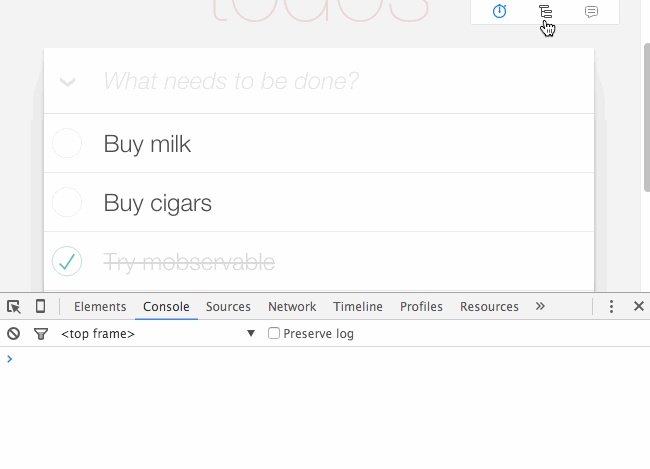

# mobx-react-devtools

DevTools for MobX to track the rendering behavior and data dependencies of your app.



## Installation

`npm install --save-dev mobx-react-devtools`

or

`<script src="https://unpkg.com/mobx-react-devtools"></script>`

## Usage

Somewhere in your application, create a DevTools component:

```js
import DevTools from 'mobx-react-devtools';

class MyApp extends React.Component {
  render() {
    return (
      <div>
        ...
        <DevTools />
      </div>
    );
  }
}
```

or

`React.createElement(mobxDevtools.default)`

Supported props:
* `highlightTimeout` — number, default: 1500
* `position` — object, position of control panel, default: `{ top: 0, right: 20 }`

From there on, after each rendering a reactive components logs the following three metrics:
1. Number of times the component did render so far
2. The time spend in the `render()` method of a component
3. The time spend from the start of the `render()` method until the changes are flushed to the DOM

For each component the color indicates roughly how long the coloring took. Rendering times are cummalitive; they include time spend in the children
* Green: less then 25 ms
* Orange: less then 100 ms
* Red: rendering for this component took more than 100ms

### About log groups

Note that if logging is enabled, MobX actions and reactions will appear as collapsible groups inside the browsers console.
Mind that any log statements that are printed during these (re)actions will appear inside those groups as well, so that you can exactly trace when they are triggered.

### Configuration

```js
import DevTool, { configureDevtool } from 'mobx-react-devtools';

// Any configurations are optional
configureDevtool({
  // Turn on logging changes button programmatically:
  logEnabled: true,
  // Turn off displaying conponents' updates button programmatically:
  updatesEnabled: false,
  // Log only changes of type `reaction`
  // (only affects top-level messages in console, not inside groups)
  logFilter: change => change.type === 'reaction',
});

```

There are also aliases for turning on/off devtools buttons:

```js
import { setLogEnabled, setUpdatesEnabled, setGraphEnabled } from 'mobx-react-devtools';

setLogEnabled(true); // same as configureDevtool({ logEnabled: true });
setUpdatesEnabled(false); // same as configureDevtool({ updatesEnabled: false });
setGraphEnabled(false); // same as configureDevtool({ logFilter: false });
```

### Custom panel design

```js
import DevTool, { GraphControl, LogControl, UpdatesControl } from 'mobx-react-devtools';

class MyNiceButton extends React.Component {
  render() {
    const { active, onToggle, children } = this.props;
    return (
      <button onClick={onToggle}>
        {children}
        {active ? ' on' : ' off'}
      </button>
    );
  }
}

class MyApp extends React.Component {
  render() {
    return (
      <div>

        {/* Include somewhere with `noPanel` prop. Is needed to display updates and modals */}
        <DevTool noPanel />

        <div className="my-custom-devtools-panel-design">
          <GraphControl>
            {/* Must have only one child that takes props: `active` (bool), `onToggle` (func) */}
            <MyNiceButton>Graph</MyNiceButton>
          </GraphControl>
          <LogControl>
            {/* Must have only one child that takes props: `active` (bool), `onToggle` (func) */}
            <MyNiceButton>Log</MyNiceButton>
          </LogControl>
          <UpdatesControl>
            {/* Must have only one child that takes props: `active` (bool), `onToggle` (func) */}
            <MyNiceButton>Updates</MyNiceButton>
          </UpdatesControl>
        </div>
      </div>
    );
  }
}
```

## Roadmap

* ~~Be able to turn dev-tools on and off at runtime~~
* ~~Select and log dependency tree of components~~
* Visualize observer tree values
* ~~Be able to enable state change tracking from the extras module~~

## Changelog

4.2.11

* Added MobX 3 support

4.2.9
* Fixed typescript typings (#42)

4.2.8
* Fixed typescript typings (#36)

4.2.7
* Fixed passing highlightTimeout from DevTool (#41)

4.2.6
* Fixed “max event listeners” warning when rendering in node.js ()

4.2.5
* Added ability to filter displaying changes in console
* Fixed submitting forms by DevTools panel buttons (#29)

4.2.4
* Added ability to change buttons state programmatically(#27)

4.2.3
* Made console colors lighter (#25)

4.2.2
* Added modular devtools controls (#21)

4.0.5
* Added Object.assign polyfill to avoid issues with server side rendering on old node vesions

4.0.2
* Make sure AMD / root imports work (#12)
* DevTools should now 'work' (not do anything) when used in Isomorphic rendering (#11)
* Highlighting boxes now show up at the proper coordinates when using complex stacking contexts

4.0.1
* Added typescript typings (see #6)
* Use (fix) uglify, by @evoyy
* Added option to customize the position of the toolbar (by @evoyy)

4.0.0
* Upgraded to MobX 2.0 / MobX React 3.0
